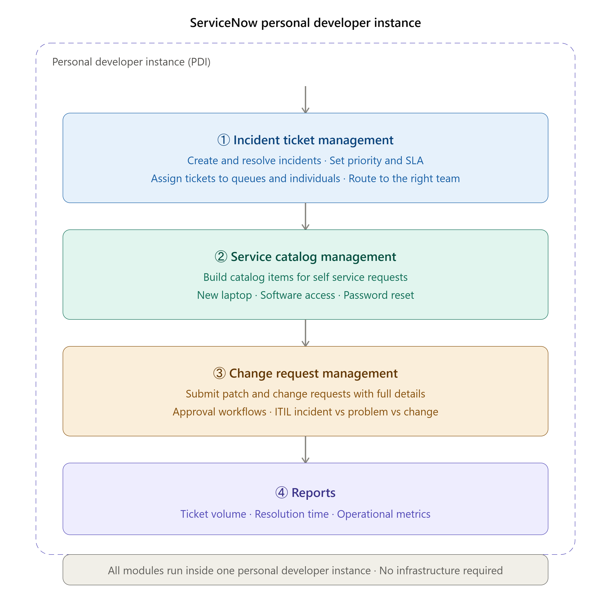
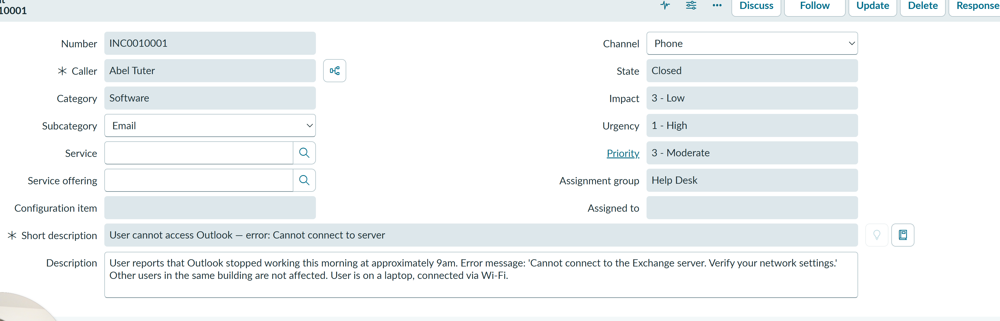
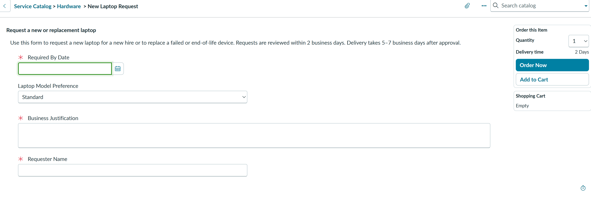
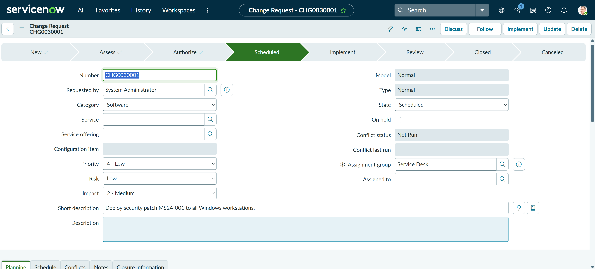
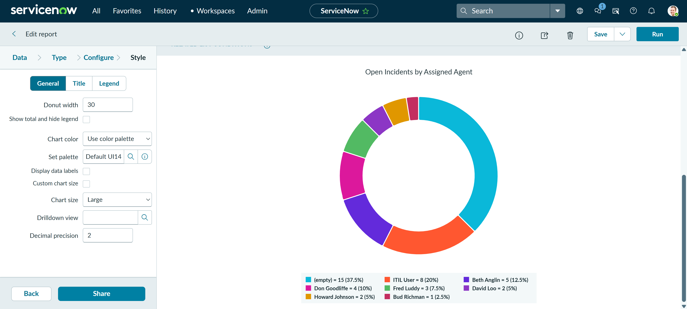

# Lab 4 — ServiceNow ITSM

A hands-on lab using a free ServiceNow Personal Developer Instance to work IT tickets end to end: incident management, a self-service catalog item, a change approval workflow, and reporting.

## 🎥 Demo Video
[Watch me build this lab end-to-end →](https://www.loom.com/share/556a49187ecc4c049f187dca1e3bc882)

## Overview

| Field | Value |
|---|---|
| Certification alignment | CompTIA A+ · Network+ · ITIL 4 Foundation |
| Tools used | ServiceNow Personal Developer Instance (free, no credit card) |
| Time to complete | 2 to 3 hours |
| Cost | $0 |
| Career relevance | IT Support, Help Desk, Sysadmin, ITSM Platform Administrator |

## The Problem This Lab Solves

When users report IT problems, those problems need to be tracked, routed, prioritized, assigned, and resolved consistently, or things fall through the cracks. ServiceNow is an IT Service Management (ITSM) platform that enforces process around this. Incidents follow a defined workflow, changes require approval before they touch production, and routine requests come from a self-service catalog instead of a phone call to the help desk.

ServiceNow is one of the most widely deployed platforms in enterprise IT. Most IT support and sysadmin roles use it, or something functionally identical, from day one, so hands-on experience with it before starting a job is a real differentiator.

## How This Lab Works

Everything in this lab runs inside a single Personal Developer Instance, no infrastructure to stand up. The four modules build on each other in a natural order: incidents get created and resolved first, the service catalog gives users a way to self-serve common requests, change requests introduce a formal approval gate before anything touches production, and reports tie it all together into metrics a team lead would actually look at.

## What I Built

- Requested and configured a free ServiceNow Personal Developer Instance
- Created and worked a full incident lifecycle: logged a ticket, assigned it, added internal work notes, documented a resolution, and closed it
- Built a **Service Catalog item** (New Laptop Request) with custom variables so users can self-serve a common IT request instead of filing a ticket
- Created a **Change Request** with a risk and impact assessment, test plan, and backout plan, then routed it through an approval workflow
- Built reports on incident volume, resolution time, and workload distribution

## Skills Demonstrated

| Skill | Real-world application |
|---|---|
| Creating and resolving an Incident | The most common task in every IT support role, from day one |
| Setting ticket priority and SLA | Priority drives response time commitments to the business |
| Assigning tickets to queues and individuals | Correct routing avoids wasted time and delayed resolution |
| Building a Service Catalog item | Lets users self-serve routine requests, reducing ticket volume |
| Creating an approval workflow | Change requests need authorization before touching production |
| Running reports on ticket data | Metrics drive IT operations decisions at every level |
| Understanding ITIL Incident, Problem, and Change | The core process vocabulary used across enterprise IT |

## Setup, Step by Step

### 1. Get a free instance
1. Go to `developer.servicenow.com`
2. Click **Sign Up** and create a free account. Email and password only, no credit card required
3. Click **Request Instance**
4. Select the latest stable release (Washington or newer)
5. Click **Request**. The instance provisions in 10 to 15 minutes
6. Check your email for the instance URL (format: `dev12345.service-now.com`) and login credentials

> ServiceNow hibernates a Personal Developer Instance after 10 days of inactivity and reclaims it after 30. Log in at least once a week to keep it, and your work, alive.

### 2. Navigate the platform
Key modules used in this lab, found in the left navigation panel:
- **Incident** → Service Desk → Incidents
- **Problem** → Service Desk → Problems
- **Change** → Change → Changes
- **Service Catalog** → Service Catalog → Catalogs
- **Reports** → Reports → Create New
- **Workflow Editor** → Process Automation → Flow Designer

### 3. Create and work an incident
7. Navigate to **Service Desk → Incidents → New**
8. Fill in the form: caller (e.g. Abel Tuter), category (Software), subcategory (Email), a short description of the issue, full description, priority (3, Moderate), and Assignment Group (Service Desk)
9. Click **Submit**
10. Note the ticket number (format: `INC0001234`)
11. Open the incident, set **State** to *In Progress*
12. Assign it to yourself
13. Add a **Work Note** documenting troubleshooting steps and an ETA (internal, IT-only)
14. Add a **Resolution Note** documenting the fix
15. Set **State** to *Resolved*, then *Closed*

### 4. Build a service catalog item
16. Navigate to **Service Catalog → Catalogs → Service Catalog**
17. Click **Maintain Items → New**
18. Fill in name (e.g. "New Laptop Request"), category (Hardware), short description, full description, fulfillment group (IT Hardware Team), and leave price blank
19. Click **Submit**
20. Go to the **Variables** tab and add fields: Requester Name (text, mandatory), Business Justification (multi-line text, mandatory), Required By Date (date, mandatory), Laptop Model Preference (select box, optional)
21. **Save and Preview**. The item now appears in the catalog portal

### 5. Create a change request with an approval workflow
22. Navigate to **Change → Changes → New (Standard)**
23. Fill in short description, category, risk, impact, start and end date, and a full description including the rollback plan
24. Under the **Planning** tab, add a Test Plan and Backout Plan
25. Click **Request Approval**. This moves the change to *Pending Approval*
26. Go to the **Approvals** tab and approve it as the admin user
27. Confirm the change moves to *Scheduled*

### 6. Build reports
28. Navigate to **Reports → Create New**
29. Name it (e.g. "Incident Volume by Priority, Last 30 Days")
30. Set Data to `Incident [incident]`, Type to Bar Chart, Group by to Priority
31. Add a condition: Created is on or after 30 days ago
32. Click **Save and Run**
33. Repeat for two more reports: **MTTR by Assignment Group** and **Open Incidents by Assigned Agent**

## Portfolio Screenshots

Four screenshots below map directly to what a real ITSM workflow needs to prove out: a fully worked incident, a self-service catalog item, an approval-gated change, and a report someone would actually use to run a team.

### 1. A completed incident with work notes and resolution

This screenshot shows ticket INC0010001 in its finished state: caller Abel Tuter, category and subcategory set to Software and Email, priority at 3-Moderate with urgency at 1-High, routed to the Help Desk assignment group, and state moved all the way through to Closed. This supports the **incident management** process, the core loop every help desk runs dozens of times a day: log the issue, work it, document what was tried, resolve it, and close it out. It matters in a real IT environment because the work note and resolution note together form the audit trail. If the same issue comes back next month, whoever picks up the next ticket can see exactly what was tried and whether it actually fixed the root cause, instead of starting the troubleshooting from zero.

### 2. The service catalog item

This is the New Laptop Request catalog item as an end user would actually see it: the Required By Date field, a Laptop Model Preference dropdown, a Business Justification box, and a 2-day delivery estimate shown up front. This supports **service catalog management**, the self-service layer that sits in front of routine requests so people do not have to call or email the help desk for things that do not need a human triage step. It matters because ticket volume is one of the biggest cost drivers in IT support. Every request that a user can submit and route themselves through a catalog form is one less ticket competing for an analyst's attention, and it gives the requester a clear expectation (2 business days for review, 5 to 7 for delivery) instead of an open-ended wait.

### 3. The approval workflow on a change request

CHG0030001 is shown sitting in the *Scheduled* state on the workflow bar, having already cleared *Assess* and *Authorize*. This supports **change management**, the ITIL process that governs any planned modification to production systems. It matters because this is the actual control that prevents uncoordinated changes from causing outages. The change could not reach *Scheduled* without first being authorized, which means someone other than the person requesting the change had to sign off on the risk, the impact window, and the rollback plan before any work was allowed to happen. That approval gate is the difference between a controlled environment and one where anyone can push a change straight to production without oversight.

### 4. A dashboard report

This donut chart breaks down open incidents by assigned agent: a large share (37.5%) unassigned, ITIL User carrying 20% of the load, and the remainder spread thin across individual agents. This supports **reporting and workload visibility**, the metrics layer that turns raw ticket data into something a team lead can act on. It matters because unassigned or unevenly distributed tickets are exactly the kind of problem that stays invisible until someone builds a report like this one. A manager glancing at this chart can immediately see that over a third of open incidents have no owner yet, which is the first sign of a queue that needs attention before SLAs start slipping.

## ITIL Concepts Applied

| ITIL Term | Definition | ServiceNow Module |
|---|---|---|
| Incident | Unplanned interruption to a service. Goal is fast restoration | Service Desk → Incidents |
| Problem | Root cause behind one or more incidents. Goal is permanent elimination | Service Desk → Problems |
| Change | Planned modification to infrastructure or applications | Change → Changes |
| Service Request | A request for something new (access, hardware), not a break or fix | Service Catalog |
| SLA | Committed response and resolution time by priority level | SLA → SLA Definitions |
| CMDB | Record of every IT asset and its relationships | Configuration → CIs |
| Knowledge Base | Documented known issues and solutions, reducing repeat incidents | Knowledge → Articles |

## Notes and Lessons Learned

- ServiceNow hibernates a Personal Developer Instance after 10 days of inactivity and reclaims it after 30. Logging in weekly keeps it, and the work in it, alive.
- Separating **work notes** (internal, IT-only) from **resolution notes** (customer-facing) reflects real help desk practice and keeps the audit trail clean.
- The approval step on the change request is the actual control. Without it, anyone could push a change straight to production.

## Related Labs

- **Lab 3** — Splunk SIEM & Log Analysis
